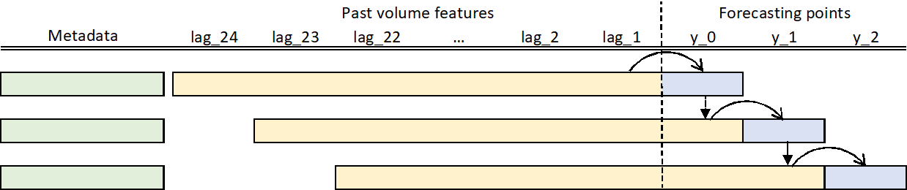

# Novartis Datathon 2020

This datathon have two challenges

## Data Science challenge

Participants are required to provide __24 months of volume forecast__ after the generic entry data together with a __95% confidence intervals__ for the given prediction for all the branchs in the test set.

## Business challenge

Provide a __deep exploratory analysis__ on the correlation __between features__ provided and the __impact in the volume sold__ after the generics entry.

# Training

## Training methodology 

24 models have been trained, one for each point. The predicted value of one model is fed into the the next model.

  

Same features are used in all the models but with a different subset of products because, as we are moving forward, we have less products to train our model.

| Description                              	| Numer of products 	|
|------------------------------------------	|-------------------	|
| Number of products to train model `y_0`  	|        982        	|
| Number of products to train model `y_1`  	|        973        	|
| Number of products to train model `y_2`  	|        965        	|
| Number of products to train model `y_3`  	|        952        	|
|                    ...                   	|        ...        	|
| Number of products to train model `y_21` 	|        784        	|
| Number of products to train model `y_22` 	|        778        	|
| Number of products to train model `y_23` 	|        768        	|

## Tuning parameters

Parameters have been tunned using a nested *GroupKFold* to get an unbiased estimate of the performance of the model.

- We have used 20 folds to find the best hyper parameters of the model (inner loop)
- We have used 3 folds to get an estimate of the generalization performance (outer loop).

With this approach, we end up with up to three different models for each point. Why up to three models? Because in each fold (outer loop) the hyper parameters found can be different. Finally, the average is taken.

This procedure has been done for each of the 24 models

  

## Features

This set of features has been called `metadata`
- country
- brand
- month_name encoded as sinus and cosinus
- num_generics
- presentation
- therapeutic area
- channel rate

Volume features
- lagged sales (24/48 past sales)

Other features
- Percentage growth before generics entry
- Number of months in the market before generics entry

# Results

## Experiments

This are the results of some of the experiments carried out.

| Model class          	| window size 	| Custom metric 	| Uncertainty metric 	|
|----------------------	|-------------	|---------------	|--------------------	|
| HistGradientBoosting 	| 24          	| 5,32          	| 31,00              	|
| HistGradientBoosting 	| 48          	| 5,35          	| 31,08              	|
| RandomForest         	| 24          	| 5,59          	| 32,48              	|
| RandomForest         	| 48          	| 5,65          	| 32,72              	| 

## Training predictions

Examples of out of sample forecast generated during the training process.

## Forecast submitted

And some examples of the submitted forecasts

# Machine Learning model monitoring

During the training process we have been tracking the Mean Absolute Error (MAE), Mean Average Percentage Error (MAPE) and the Coverage fraction.

## Mean Absolute Error

We can track the metrics for each model. As looking at the mean errors is quite limiting, we should also look at the standard deviation to assess the dispersion of the score.

  

## Coverage Fraction

The coverage fraction calculates what percentage of the predicted points falls within the intervals.

  

## Predicted vs Target

Perfect predictions would be in the diagonal line, so the more points on the diagonal line, the better the model will be for that point. The first few points are more difficult to predict than the rest.

  

## Feature importance

Feature importances are different in every model. For this model, `y_0`, *channel_rate_C*, *country*, *num_generics* and some *lags* are the most important features.

  

# Contact ✒️

Carlos Espeleta - @Carlos_Espeleta

LinkedIn: https://www.linkedin.com/in/carlos-espeleta
